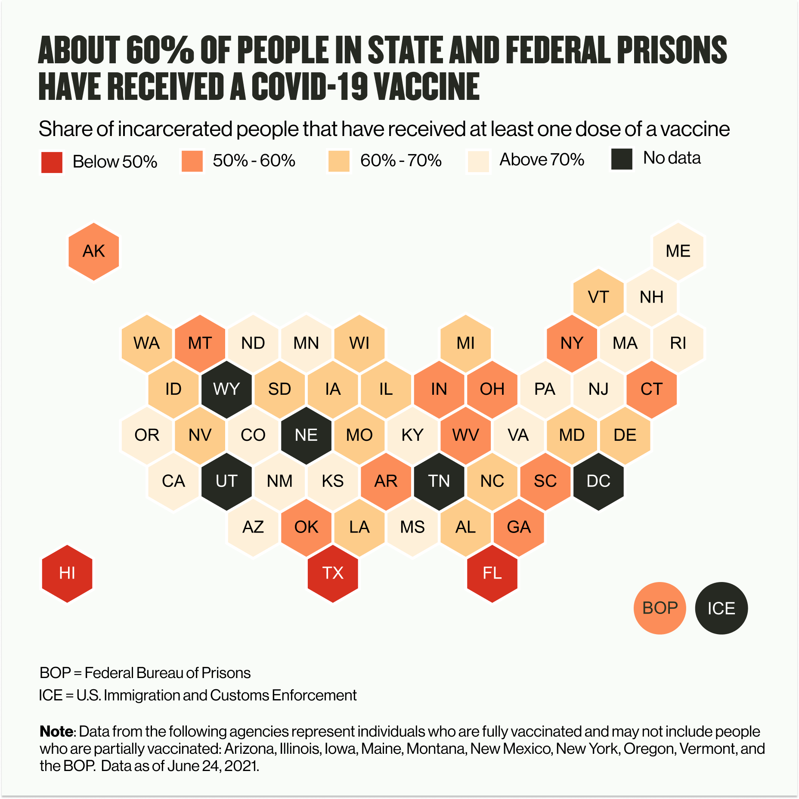
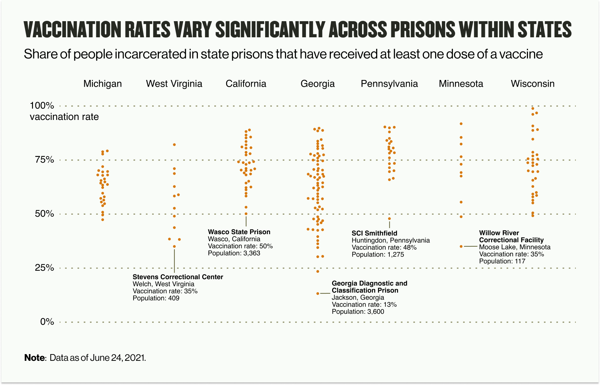
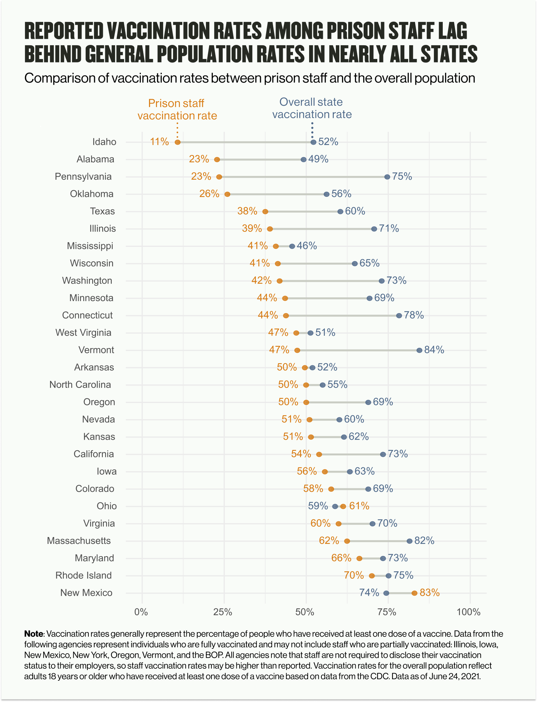

Over the last 16 months, more than 400,000 people have tested positive for COVID-19 inside state and federal prisons nationwide, along with nearly 18,000 people in immigration detention centers and at least 107,000 in county jails. At the peak of the pandemic last December, more than 25,000 new cases were detected in state and federal prisons in just one week.

Since then, cases have dropped dramatically. Last week, the week of June 14th, agencies reported fewer than 300 new cases. This, of course, is due in large part to the arrival of vaccines.

But still, the risk remains. Dangerous conditions inside carceral facilities — marked by overcrowding, poor ventilation, limited access to personal protective equipment, and the inability to maintain physical distance — mean that jails and prisons will remain susceptible to COVID-19 outbreaks.

One facility in Hawaii, still recovering from a massive outbreak, serves as a cautionary tale against complacency and the dangers of low vaccination rates. Despite reporting just one COVID-19 case throughout the entirety of the pandemic, the Hawaii Community Correctional Center (HCCC) has seen [more than 220 people](https://dps.hawaii.gov/blog/2020/03/17/coronavirus-covid-19-information-and-resources/) inside test positive in recent weeks. At the peak of the outbreak earlier this month, HCCC was operating well overcapacity, [cramming 358 people in a facility built to hold just 206](https://dps.hawaii.gov/wp-content/uploads/2021/06/Pop-Reports-Weekly-2021-06-07.pdf). And per an estimate by the state’s Lieutenant Governor, [just 25% to 50%](https://www.staradvertiser.com/2021/06/01/hawaii-news/most-hawaii-inmates-refusing-to-get-covid-19-vaccination/) of people incarcerated in Hawaiian correctional facilities have been vaccinated.

As we continue to survey the vaccine rollout in prison systems across the country, we have identified several key takeaways that raise cause for concern.

#### **Vaccination rates are lower than they need to be to achieve herd immunity in many places**

In May, the Prison Policy Initiative reported that [55% of people in prisons](https://www.prisonpolicy.org/blog/2021/05/18/vaccinationrates/) were at least partially vaccinated. One month later, across the 45 prison systems for which we have collected data on vaccinations, we estimate that still only approximately 60% of people inside state and federal prisons have received at least one dose of a vaccine (although, [as we’ve previously written](https://uclacovidbehindbars.org/blog/vaccinedata), the continued lack of transparency on the part of many carceral agencies makes it difficult to reliably estimate and compare these rates across systems). In several states, including Florida, Texas and Hawaii, agency officials estimate that less than half of people in their custody have been vaccinated.

When it comes to managing individual outbreaks, what matters most is vaccination rates within individual facilities. Even in states where the overall statewide vaccination rate in prisons is relatively high, individual facilities have reported much lower rates. For example, the [California Department of Corrections and Rehabilitation (CDCR)](https://www.cdcr.ca.gov/covid19/population-status-tracking/) reports that over 72% of the state’s total incarcerated population has been at least partially vaccinated. In Wasco State Prison in central California, however, just 50% of incarcerated people have received at least one dose. The [Pennsylvania Department of Corrections](https://www.cor.pa.gov/Pages/COVID-19.aspx#Dashboard) similarly reports a high overall vaccination rate of 78% across that state’s 24 facilities. In the Smithfield Correctional Institution, however, just 48% of the 1,275 people inside have received at least one shot. Of the 33 active cases inside Pennsylvania prisons right now, 18 are inside that one facility.

#### **Vaccination rates are concerningly low among prison staff**

Based on the limited data on staff vaccinations reported by agencies, it appears that the majority of officers are [still declining the vaccine](https://www.prisonpolicy.org/blog/2021/04/22/vaccinerefusal/) in many places. Of the 29 agencies publishing data on staff vaccination in the past month, only 12 report rates above 50%. In Alabama and Pennsylvania, just 23% of staff report being vaccinated, along with less than 25% in Oklahoma. Just over 50% of staff of the Federal Bureau of Prisons report being vaccinated.

Many agencies note that staff are not required to report vaccines from community health providers, which means that reported staff data may understate true vaccination levels. Without data reflecting the true level of staff vaccination, it is impossible to accurately gauge the level of protection from COVID-19 infection for either prison staff or incarcerated people in any given facility.

While we hope that true staff vaccination rates are much higher than reported, anecdotes from across the country provide reason for concern. [In Florida](https://www.themarshallproject.org/2021/03/15/hell-no-correctional-officers-are-declining-the-coronavirus-vaccine-en-masse), a correctional officer polled his colleagues in a private Facebook group asking if they would take the vaccine if offered; more than half responded “Hell no,” and only 40 of 475 respondents said yes. In New York, where [just 28% of prison staff are vaccinated](https://gothamist.com/news/less-third-ny-prison-staff-vaccinated-against-covid), the union representing correctional officers said that it wasn’t “overly encouraging” its members to get vaccinated, with the president of the union adding, “Who am I to suggest to anybody as to what to put into their body?”

In all but two (New Mexico and Ohio) of the 29 states reporting data, staff vaccination rates lag behind rates among adults in the overall population, despite correctional officers receiving priority access beginning in January in nearly all state vaccine rollout plans. So far, only one state, New Mexico, has mandated that correctional staff be vaccinated. By mid-May, [nearly 85% of officers in New Mexico prisons had been vaccinated](https://www.kob.com/new-mexico-news/nm-department-of-corrections-reaches-vaccination-milestone/6106070/) — the highest rate reported by any state.

#### **Vaccination policies and practices have been unclear and inconsistent**

As federal and state agencies started planning their vaccine rollout late last year, [only 10 states](https://www.prisonpolicy.org/blog/2020/12/08/covid-vaccination-plans/) clearly included incarcerated people in Phase I for priority access, equal to other especially vulnerable groups. As the rollouts began and plans were revised, more states included incarcerated people for priority access to the vaccines. Of the 51 prison jurisdictions we track (50 state correctional departments and the Federal Bureau of Prisons), 37 explicitly included incarcerated people for some form of priority access over the general population. As for prison officers, nearly all jurisdictions (48 of 51) offered staff priority access.

Despite these written policies, information concerning vaccine administration in practice has been unclear and confusing. Though nearly all states universally offered the vaccine to prison staff, many states that prioritized access to incarcerated people limited that access to only those who are medically vulnerable or experienced certain specific risk factors — a small subset of the total prison population. Some jurisdictions that prioritized incarcerated people for early access, including [Colorado](https://coloradosun.com/2020/12/02/colorad-coronavirus-vaccine-polis-prisoners/), [Illinois](https://www.chicagotribune.com/investigations/ct-coronavirus-illinois-prison-vaccine-plan-update-20210213-7pshvlwhmjgopl3qgfxfl46avy-story.html), and [Wisconsin](https://www.jsonline.com/story/news/politics/2021/01/21/republicans-propose-making-covid-vaccine-available-everyone-mid-march/4231850001/), later saw political backlash; where this occurred, slowdowns in vaccine distribution behind bars seemed to follow.

In other states, such as [New York](https://www.nytimes.com/2021/03/29/nyregion/covid-vaccine-new-york-prisons.html) and [Oregon](https://www.nytimes.com/2021/02/03/world/oregon-prison-inmates-vaccine.html#:~:text=A%20federal%20court%20judge%20in,inside%20prisons%20have%20been%20common.), courts have stepped in ordering the state to begin offering vaccines to incarcerated people. Several more [lawsuits](https://www.usatoday.com/story/news/nation/2021/05/08/covid-prison-how-us-inmates-fought-vaccines-protection/6879647002/) have been filed by incarcerated people and prisoners’ rights advocates against correctional agencies unwilling to vaccinate incarcerated people or to do so expeditiously.

The state of vaccination in Immigration and Customs Enforcement (ICE) detention is especially concerning. Despite seeing some of the [worst outbreaks in recent weeks](https://theintercept.com/2021/06/20/covid-asylum-detention-ice/), and an [extensive legal battle](https://www.motherjones.com/politics/2021/03/youre-doing-nothing-judge-slams-ice-for-failing-to-vaccinate-detainees/) over its failure to vaccinate ICE detainees in its New York facilities, ICE still has [no clear plan](https://www.businessinsider.com/vaccine-rollout-neglects-ice-detainees-2021-2) for vaccinating those in its custody. ICE policy has largely been to leave it up to the state health departments where facilities are located to vaccinate the detained population. States, in turn, have pushed back against this policy, on the ground that the safety of ICE detainees is a federal responsibility. This [tussle over jurisdiction](https://phr.org/our-work/resources/the-united-states-urgently-needs-a-covid-19-vaccination-plan-for-people-in-immigration-detention/) has left the [more than 26,000 people](https://www.ice.gov/coronavirus) in ICE detention facilities neglected and vulnerable to COVID-19 infection and death.

#### **Agencies have not taken steps necessary to inspire trust in the vaccine among the incarcerated and staff**

From the beginning of the vaccine rollout, very few carceral agencies had a clear plan for how they would encourage people living and working behind bars to accept the vaccine. Even though several [surveys indicated](https://www.cdc.gov/mmwr/volumes/70/wr/mm7013a3.htm?s_cid=mm7013a3_e&ACSTrackingID=USCDC_92https://www.cdc.gov/mmwr/volumes/70/wr/mm7013a3.htm?s_cid=mm7013a3_e&ACSTrackingID=USCDC_921-DM53653&ACSTrackingLabel=This%20Week%20in%20MMWR%20-%20Vol.%2070%2C%20April%202%2C%202021&deliveryName=USCDC_921-DM5365353653) high hesitancy among these populations very early on, agencies have largely failed to adopt targeted outreach to offer the vaccine, ensure meaningful consent, and address concerns.

In fact, in many cases prisons have egregiously botched vaccination campaigns, compounding generations of well-earned distrust by those in their custody. In April, 77 people incarcerated at the [Iowa State Penitentiary](https://www.desmoinesregister.com/story/news/crime-and-courts/2021/04/21/iowa-prison-gives-overdoses-coronavirus-covid-19-vaccine-inmates-fort-madison-department-corrections/7328432002/) were given a dose of vaccine six times that of the normal dose. In May, a prison in [Washington](https://www.king5.com/article/news/health/coronavirus/vaccine/monroe-washington-prison-outdated-covid-vaccine/281-2c53de2e-4752-4387-9328-80dd084a77fc) reportedly administered vaccines that had [passed their expiration date](https://www.heraldnet.com/opinion/comment-expired-vaccine-for-monroe-prisoners-a-shot-to-trust/), and those inside only learned about what happened from a local television news station. After the recommended pause on the Johnson & Johnson vaccine, [New York](https://gothamist.com/news/ny-quietly-stopped-vaccinating-people-in-state-prisonsbut-promised-to-resume-after-questioning) prisons entirely stopped vaccinating incarcerated people instead of administering other vaccines, and resumed their vaccination program only after officials were later questioned.

There is reason to believe that taking efforts to inspire trust — and respect those in custody — will result in a higher vaccination rate. In California’s prisons, among those who initially declined and were subsequently offered a vaccine, [46% later chose to be vaccinated](https://www.nejm.org/doi/full/10.1056/NEJMc2105282).

Many incarcerated individuals have cited [concerns about the safety and efficacy](https://www.cdc.gov/mmwr/volumes/70/wr/mm7013a3.htm?s_cid=mm7013a3_x) of the vaccine and [distrust in the correctional medical system](https://www.themarshallproject.org/2021/03/01/we-asked-people-behind-bars-how-they-feel-about-getting-vaccinated) delivering the shots. Some have [cited](https://theintercept.com/2021/06/20/covid-asylum-detention-ice/) fears that medical staff would be unable or unwilling to treat them if they developed adverse reactions to the shot, and others have [reported](https://www.brennancenter.org/our-work/analysis-opinion/covid-19-and-struggle-health-behind-bars) having had little or no opportunity to understand the vaccine and its effects directly from healthcare staff or a trusted authority.

While distributing FAQ brochures and sharing informational videos are basic steps in the right direction, overcoming systemic distrust will require much more targeted outreach involving family members and loved ones on the outside, leaders inside prisons, and trusted individuals from the broader community. Though some agencies have offered commissary benefits and small sentence reductions as incentives (such as [North Carolina](https://www.charlotteobserver.com/news/coronavirus/article248866464.html), [Delaware](https://apnews.com/article/health-dover-delaware-coronavirus-pandemic-prisons-23a9561552bde1feec73e88e2e73705e), and [Maryland](https://wtop.com/maryland/2021/05/maryland-inmates-promised-snacks-commissary-packages-if-they-choose-vaccination/)), more targeted approaches to convince those with serious concerns about the vaccine or its administration remain largely lacking.

As life outside inches towards some form of normalcy, COVID-19 still poses a significant threat for those behind bars. Releases have tapered, prison and jail intakes have resumed, and vaccination rates are still lagging in many places. As we continue to count the shots, we hope that carceral agencies and health authorities make every effort to increase vaccination rates in the coming weeks and months. Moreover, if the past year has taught us anything, it is that incarceration itself is a public health risk — decarceration remains the most important way to protect the health and safety of those behind bars.

_Note: In addition to the data that we collect directly from agencies, we also included information on vaccination numbers and rates from news sources and leveraged data from [The Marshall Project ](https://www.themarshallproject.org/2020/05/01/a-state-by-state-look-at-coronavirus-in-prisons)and [The Associated Press](https://www.themarshallproject.org/2020/05/01/a-state-by-state-look-at-coronavirus-in-prisons) for this piece. Data reflect the most recent information available as of June 24, 2021. See [here](https://docs.google.com/spreadsheets/d/1kh7vldEWeZV2g7h1XtxDa7meXfHb96eqkp1jyYJfRHc/edit#gid=820434652) for more details._
