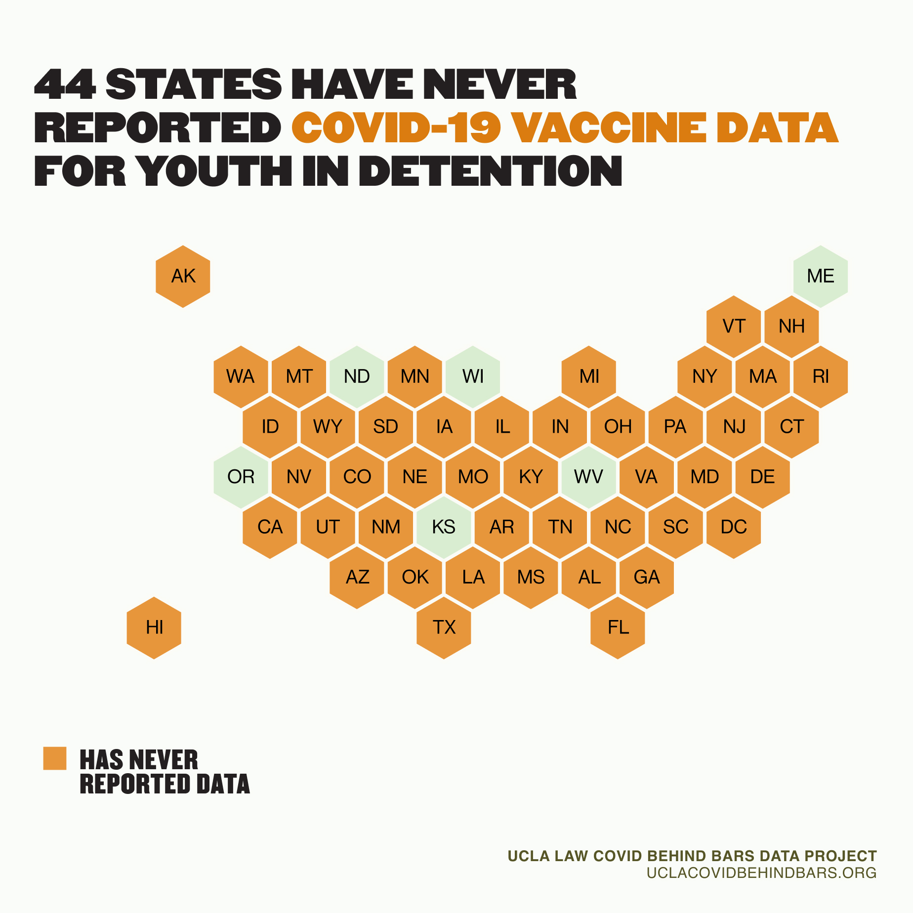
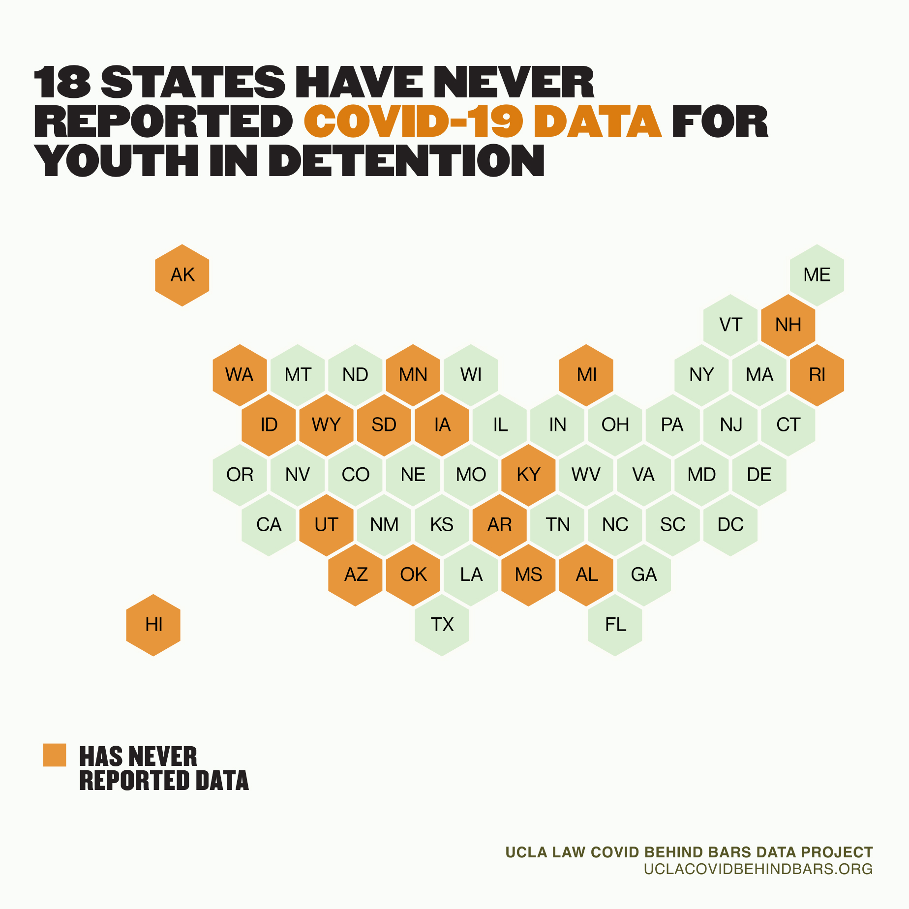

It’s been more than two months since the FDA authorized a COVID-19 vaccine to be used for 12- to 15-year-olds. But thus far, the vaccine rollout seems to be neglected one group of children at high risk for contracting COVID-19: those in detention or prison. 

It is hard to know just how many children in confinement have been vaccinated across the United States. As of this writing, only six states ([Kansas](https://www.doc.ks.gov/kdoc-coronavirus-updates/covid-19-vaccinations), [Maine](<https://www.maine.gov/corrections/sites/maine.gov.corrections/files/inline-files/MDOC COVID19 WebDashboard6-18-2021.pdf>), [Oregon](https://www.oregon.gov/oya/Pages/COVID.aspx), [Wisconsin](https://doc.wi.gov/Pages/COVID19(Coronavirus)/COVID19TestingDashboard.aspx), [North Dakota](https://www.docr.nd.gov/covid-19-information), and [West Virginia](https://dhhr.wv.gov/COVID-19/Pages/Correctional-Facilities.aspx)) have published any vaccination numbers for their youth in detention, and those numbers are generally very low. According to its own reports, North Dakota has not vaccinated a single child in detention. In West Virginia, about 36 percent of incarcerated youth at state-run facilities have or will soon be fully vaccinated.

It may be that other states are vaccinating children in detention without releasing data to show it. For example, New York’s Office of Child and Family Services announced its intention to [prioritize](https://abcnews.go.com/Health/york-teens-16-older-homeless-jailed-foster-care/story?id=76084995) vaccinating incarcerated youth. As yet, however, there are no public metrics showing that it is. 

Such data gaps are not new: state agencies have failed to report basic health data about the children in their custody throughout the pandemic. Since the public health crisis started, 18 states have not reported any COVID-related health data at all concerning the children in their custody.

Juvenile justice agencies are responsible for the care of society’s most vulnerable children and should take all possible steps to honor this public trust, including accelerating vaccination distribution in the midst of a global pandemic. At a minimum, public agencies incarcerating children should provide timely, transparent, and publicly accessible data on vaccination rates for the youth they hold in their custody. 

Children in detention and prison are at high risk for COVID-19 infection, and high risk for health complications if infected. There have been more than 5,000 confirmed cases of COVID-19 among youth in detention facilities across the United States, a population that [has higher rates of asthma](https://pubmed.ncbi.nlm.nih.gov/28300655/), a risk factor for health complications. This population of children also faces considerable [gaps in Medicaid coverage](https://pediatrics.aappublications.org/content/140/5/e20171107), suggesting a higher likelihood of untreated pre-existing conditions.

Because of broader and longstanding gaps in data concerning juvenile detention – including data as basic as the total numbers of children held in custody in each system and across the country – we cannot calculate total COVID positivity rates among children in custody, nor estimate how many children have yet to test positive but remain vulnerable.

The COVID crisis renders children in custody vulnerable in other ways that demand attention, as well. Even when young people in detention do not become infected with the virus, they are tremendously vulnerable to mental health effects from draconian lockdown measure. Detaining young people, even without stricter lockdown measures, [dramatically increases their risk of self-harm](https://pubmed.ncbi.nlm.nih.gov/28374220/) and the long-term incidence of suicide, [well into adulthood](https://www.ncbi.nlm.nih.gov/pmc/articles/PMC5260153/). 

Since the start of the pandemic, most children in detention — a category that in some jurisdictions includes children as young as 10 years old—have been unable to have [in-person visitation](https://www.themarshallproject.org/2020/03/23/i-want-to-see-my-child-juvenile-lockups-cut-visits-over-covid-19-fears). Those who have been able to return to in-person visits are often unable to hug their family members due to no-contact visitation. Many have been unable to return to in-person schooling, and there are [reports](https://www.injusticewatch.org/news/juvenile-justice/2021/state-investigation-special-ed-juvenile-jail/) of youth missing out on federally mandated therapeutic services and supports to address their learning disabilities or mental health challenges due to restrictions adopted to prevent COVID spread. 

During the pandemic, Black and Latinx children have been released from juvenile detention centers at rates [far lower](https://www.themarshallproject.org/2021/03/08/many-juvenile-jails-are-now-almost-entirely-filled-with-young-people-of-color) than their white peers, compounding and further re-entrenching racial inequities in juvenile detention systems.  Youth of color have also been [detained](https://www.themarshallproject.org/2021/03/08/many-juvenile-jails-are-now-almost-entirely-filled-with-young-people-of-color) for much longer periods than they were before the pandemic. 

Like all incarcerated people, children in detention lack any meaningful control over their environment, a situation that can make them especially vulnerable to infection. This danger is particularly acute given the low vaccination rates among corrections staff, which can greatly increase exposure to the virus. Because there is so little reporting on the vaccination rate of staff in juvenile facilities, we cannot know just how great that risk is. There is reason to be concerned, however, that those rates are low: in West Virginia, only 37% of juvenile services employees have been vaccinated on-site (there is no data on off-site vaccinations). Across the country, vaccine acceptance rates among prison staff have been [concerningly low](https://uclacovidbehindbars.org/blog/counting-the-shots). 

Holding young people in detention and separating them from their families — and in doing so, disrupting their development, education, and life trajectory — has always been an ill-conceived practice with severe consequences for the health and safety of vulnerable youth. The pandemic has made it even more clear, however, that youth incarceration is both a moral crisis and a threat to public health. 

As the pandemic continues to unfold, and young people nationwide are offered access to vaccinations, concerted efforts must be made to ensure that all the children we have collectively chosen to incarcerate receive the COVID vaccine as soon as possible.

\_\_\_\_\_\_\_\_\_\_\_\_\_\_\_\_\_\_\_\_\_\_\_\_\_\_\_\_

State 	              Number of Incarcerated Youth Who Have Received at Least One Dose 
Kansas                  67
Maine                   ~11* 
Oregon                 432 
Wisconsin            145 
North Dakota       0 
West Virginia         74 

As of July 19, 2021

  <table>
    <thead>
      <tr>
        <th>State</th>
        <th>Number of incarcerated youth who have received at least one dose</th>
      </tr>
    </thead>
    <tbody>
      <tr>
        <td>
          <a Kansas</a>
        </td>
        <td>
          67
        </td>
      </tr>
      

<tr>
        <td>
          <a Maine</a>
        </td>
        <td>
          ~11*
        </td>
      </tr>

<tr>
        <td>
          <a Oregon</a>
        </td>
        <td>
          432
        </td>
      </tr>

<tr>
        <td>
          <a Wisconsin</a>
        </td>
        <td>
          145
        </td>
      </tr>

<tr>
        <td>
          <a North Dakota</a>
        </td>
        <td>
          0
        </td>
      </tr>

<tr>
        <td>
          <a West Virginia</a>
        </td>
        <td>
          74
        </td>
      </tr>

<tr>
        <td>
          <a href="/ice#scorecard">ICE</a>
        </td>
        <td>
          F
          (10 / 32)
        </td>
        <td>
          2 / 8
        </td>
        <td>
          8 / 12
        </td>
        <td>
          0 / 12
        </td>
      </tr>
      <tr>
        <td>
          <a href="/states/alabama#scorecard">Alabama</a>
        </td>
        <td>
          D
          (20 / 32)
        </td>
        <td>
          4 / 8
        </td>
        <td>
          8 / 12
        </td>
        <td>
          8 / 12
        </td>
      </tr>
      <tr>
        <td>
          <a href="/states/alaska#scorecard">Alaska</a>
        </td>
        <td>
          F
          (9 / 32)
        </td>
        <td>
          4 / 8
        </td>
        <td>
          5 / 12
        </td>
        <td>
          0 / 12
        </td>
      </tr>
      <tr>
        <td>
          <a href="/states/arizona#scorecard">Arizona</a>
        </td>
        <td>
          F
          (10 / 32)
        </td>
        <td>
          2 / 8
        </td>
        <td>
          7 / 12
        </td>
        <td>
          1 / 12
        </td>
      </tr>
      <tr>
        <td>
          <a href="/states/arkansas#scorecard">Arkansas</a>
        </td>
        <td>
          F
          (7 / 32)
        </td>
        <td>
          4 / 8
        </td>
        <td>
          2 / 12
        </td>
        <td>
          1 / 12
        </td>
      </tr>
      <tr>
        <td>
          <a href="/states/california#scorecard">California</a>
        </td>
        <td>
          D
          (20 / 32)
        </td>
        <td>
          6 / 8
        </td>
        <td>
          10 / 12
        </td>
        <td>
          4 / 12
        </td>
      </tr>
      <tr>
        <td>
          <a href="/states/colorado#scorecard">Colorado</a>
        </td>
        <td>
          F
          (16 / 32)
        </td>
        <td>
          4 / 8
        </td>
        <td>
          9 / 12
        </td>
        <td>
          3 / 12
        </td>
      </tr>
      <tr>
        <td>
          <a href="/states/connecticut#scorecard">Connecticut</a>
        </td>
        <td>
          F
          (9 / 32)
        </td>
        <td>
          2 / 8
        </td>
        <td>
          5 / 12
        </td>
        <td>
          2 / 12
        </td>
      </tr>
      <tr>
        <td>
          <a href="/states/delaware#scorecard">Delaware</a>
        </td>
        <td>
          F
          (13 / 32)
        </td>
        <td>
          2 / 8
        </td>
        <td>
          7 / 12
        </td>
        <td>
          4 / 12
        </td>
      </tr>
      <tr>
        <td>
          <a href="/states/district-of-columbia#scorecard">
            District of Columbia
          </a>
        </td>
        <td>
          F
          (10 / 32)
        </td>
        <td>
          6 / 8
        </td>
        <td>
          2 / 12
        </td>
        <td>
          2 / 12
        </td>
      </tr>
      <tr>
        <td>
          <a href="/states/florida#scorecard">Florida</a>
        </td>
        <td>
          F
          (6 / 32)
        </td>
        <td>
          2 / 8
        </td>
        <td>
          3 / 12
        </td>
        <td>
          1 / 12
        </td>
      </tr>
      <tr>
        <td>
          <a href="/states/georgia#scorecard">Georgia</a>
        </td>
        <td>
          F
          (15 / 32)
        </td>
        <td>
          2 / 8
        </td>
        <td>
          7 / 12
        </td>
        <td>
          6 / 12
        </td>
      </tr>
      <tr>
        <td>
          <a href="/states/hawaii#scorecard">Hawaii</a>
        </td>
        <td>
          F
          (12 / 32)
        </td>
        <td>
          2 / 8
        </td>
        <td>
          8 / 12
        </td>
        <td>
          2 / 12
        </td>
      </tr>
      <tr>
        <td>
          <a href="/states/idaho#scorecard">Idaho</a>
        </td>
        <td>
          F
          (14 / 32)
        </td>
        <td>
          4 / 8
        </td>
        <td>
          6 / 12
        </td>
        <td>
          4 / 12
        </td>
      </tr>
      <tr>
        <td>
          <a href="/states/illinois#scorecard">Illinois</a>
        </td>
        <td>
          F
          (12 / 32)
        </td>
        <td>
          0 / 8
        </td>
        <td>
          6 / 12
        </td>
        <td>
          6 / 12
        </td>
      </tr>
      <tr>
        <td>
          <a href="/states/indiana#scorecard">Indiana</a>
        </td>
        <td>
          D
          (20 / 32)
        </td>
        <td>
          4 / 8
        </td>
        <td>
          8 / 12
        </td>
        <td>
          8 / 12
        </td>
      </tr>
      <tr>
        <td>
          <a href="/states/iowa#scorecard">Iowa</a>
        </td>
        <td>
          F
          (18 / 32)
        </td>
        <td>
          4 / 8
        </td>
        <td>
          8 / 12
        </td>
        <td>
          6 / 12
        </td>
      </tr>
      <tr>
        <td>
          <a href="/states/kansas#scorecard">Kansas</a>
        </td>
        <td>
          F
          (18 / 32)
        </td>
        <td>
          2 / 8
        </td>
        <td>
          8 / 12
        </td>
        <td>
          8 / 12
        </td>
      </tr>
      <tr>
        <td>
          <a href="/states/kentucky#scorecard">Kentucky</a>
        </td>
        <td>
          F
          (14 / 32)
        </td>
        <td>
          2 / 8
        </td>
        <td>
          6 / 12
        </td>
        <td>
          6 / 12
        </td>
      </tr>
      <tr>
        <td>
          <a href="/states/louisiana#scorecard">Louisiana</a>
        </td>
        <td>
          F
          (16 / 32)
        </td>
        <td>
          2 / 8
        </td>
        <td>
          8 / 12
        </td>
        <td>
          6 / 12
        </td>
      </tr>
      <tr>
        <td>
          <a href="/states/maine#scorecard">Maine</a>
        </td>
        <td>
          F
          (8 / 32)
        </td>
        <td>
          2 / 8
        </td>
        <td>
          6 / 12
        </td>
        <td>
          0 / 12
        </td>
      </tr>
      <tr>
        <td>
          <a href="/states/maryland#scorecard">Maryland</a>
        </td>
        <td>
          D
          (21 / 32)
        </td>
        <td>
          4 / 8
        </td>
        <td>
          9 / 12
        </td>
        <td>
          8 / 12
        </td>
      </tr>
      <tr>
        <td>
          <a href="/states/massachusetts#scorecard">Massachusetts</a>
        </td>
        <td>
          F
          (0 / 32)
        </td>
        <td>
          0 / 8
        </td>
        <td>
          0 / 12
        </td>
        <td>
          0 / 12
        </td>
      </tr>
      <tr>
        <td>
          <a href="/states/michigan#scorecard">Michigan</a>
        </td>
        <td>
          F
          (16 / 32)
        </td>
        <td>
          4 / 8
        </td>
        <td>
          7 / 12
        </td>
        <td>
          5 / 12
        </td>
      </tr>
      <tr>
        <td>
          <a href="/states/minnesota#scorecard">Minnesota</a>
        </td>
        <td>
          D
          (21 / 32)
        </td>
        <td>
          6 / 8
        </td>
        <td>
          11 / 12
        </td>
        <td>
          4/ 12
        </td>
      </tr>
      <tr>
        <td>
          <a href="/states/mississippi#scorecard">Mississippi</a>
        </td>
        <td>
          F
          (4 / 32)
        </td>
        <td>
          0 / 8
        </td>
        <td>
          4 / 12
        </td>
        <td>
          0 / 12
        </td>
      </tr>
      <tr>
        <td>
          <a href="/states/missouri#scorecard">Missouri</a>
        </td>
        <td>
          F
          (10 / 32)
        </td>
        <td>
          0 / 8
        </td>
        <td>
          6 / 12
        </td>
        <td>
          4 / 12
        </td>
      </tr>
      <tr>
        <td>
          <a href="/states/montana#scorecard">Montana</a>
        </td>
        <td>
          F
          (8 / 32)
        </td>
        <td>
          2 / 8
        </td>
        <td>
          3 / 12
        </td>
        <td>
          3 / 12
        </td>
      </tr>
      <tr>
        <td>
          <a href="/states/nebraska#scorecard">Nebraska</a>
        </td>
        <td>
          F
          (7 / 32)
        </td>
        <td>
          2 / 8
        </td>
        <td>
          5 / 12
        </td>
        <td>
          0 / 12
        </td>
      </tr>
      <tr>
        <td>
          <a href="/states/nevada#scorecard">Nevada</a>
        </td>
        <td>
          F
          (10 / 32)
        </td>
        <td>
          2 / 8
        </td>
        <td>
          4 / 12
        </td>
        <td>
          4 / 12
        </td>
      </tr>
      <tr>
        <td>
          <a href="/states/new-hampshire#scorecard">New Hampshire</a>
        </td>
        <td>
          F
          (18 / 32)
        </td>
        <td>
          2 / 8
        </td>
        <td>
          11 / 12
        </td>
        <td>
          5/ 12
        </td>
      </tr>
      <tr>
        <td>
          <a href="/states/new-jersey#scorecard">New Jersey</a>
        </td>
        <td>
          F
          (8 / 32)
        </td>
        <td>
          0 / 8
        </td>
        <td>
          5 / 12
        </td>
        <td>
          3 / 12
        </td>
      </tr>
      <tr>
        <td>
          <a href="/states/new-mexico#scorecard">New Mexico</a>
        </td>
        <td>
          F
          (9 / 32)
        </td>
        <td>
          2 / 8
        </td>
        <td>
          7 / 12
        </td>
        <td>
          0 / 12
        </td>
      </tr>
      <tr>
        <td>
          <a href="/states/new-york#scorecard">New York</a>
        </td>
        <td>
          F
          (10 / 32)
        </td>
        <td>
          2 / 8
        </td>
        <td>
          6 / 12
        </td>
        <td>
          2 / 12
        </td>
      </tr>
      <tr>
        <td>
          <a href="/states/north-carolina#scorecard">North Carolina</a>
        </td>
        <td>
          F
          (19 / 32)
        </td>
        <td>
          8 / 8
        </td>
        <td>
          10 / 12
        </td>
        <td>
          1/ 12
        </td>
      </tr>
      <tr>
        <td>
          <a href="/states/north-dakota#scorecard">North Dakota</a>
        </td>
        <td>
          D
          (22 / 32)
        </td>
        <td>
          4 / 8
        </td>
        <td>
          10 / 12
        </td>
        <td>
          8/ 12
        </td>
      </tr>
      <tr>
        <td>
          <a href="/states/ohio#scorecard">Ohio</a>
        </td>
        <td>
          F
          (14 / 32)
        </td>
        <td>
          4 / 8
        </td>
        <td>
          4 / 12
        </td>
        <td>
          6 / 12
        </td>
      </tr>
      <tr>
        <td>
          <a href="/states/oklahoma#scorecard">Oklahoma</a>
        </td>
        <td>
          F
          (8 / 32)
        </td>
        <td>
          2 / 8
        </td>
        <td>
          5 / 12
        </td>
        <td>
          1 / 12
        </td>
      </tr>
      <tr>
        <td>
          <a href="/states/oregon#scorecard">Oregon</a>
        </td>
        <td>
          F
          (17 / 32)
        </td>
        <td>
          8 / 8
        </td>
        <td>
          7 / 12
        </td>
        <td>
          2 / 12
        </td>
      </tr>
      <tr>
        <td>
          <a href="/states/pennsylvania#scorecard">Pennsylvania</a>
        </td>
        <td>
          C
          (24 / 32)
        </td>
        <td>
          6 / 8
        </td>
        <td>
          12 / 12
        </td>
        <td>
          6/ 12
        </td>
      </tr>
      <tr>
        <td>
          <a href="/states/rhode-island#scorecard">Rhode Island</a>
        </td>
        <td>
          F
          (10 / 32)
        </td>
        <td>
          2 / 8
        </td>
        <td>
          4 / 12
        </td>
        <td>
          4 / 12
        </td>
      </tr>
      <tr>
        <td>
          <a href="/states/south-carolina#scorecard">South Carolina</a>
        </td>
        <td>
          F
          (16 / 32)
        </td>
        <td>
          2 / 8
        </td>
        <td>
          8 / 12
        </td>
        <td>
          6 / 12
        </td>
      </tr>
      <tr>
        <td>
          <a href="/states/south-dakota#scorecard">South Dakota</a>
        </td>
        <td>
          F
          (14 / 32)
        </td>
        <td>
          2 / 8
        </td>
        <td>
          6 / 12
        </td>
        <td>
          6 / 12
        </td>
      </tr>
      <tr>
        <td>
          <a href="/states/tennessee#scorecard">Tennessee</a>
        </td>
        <td>
          F
          (16 / 32)
        </td>
        <td>
          2 / 8
        </td>
        <td>
          9 / 12
        </td>
        <td>
          5 / 12
        </td>
      </tr>
      <tr>
        <td>
          <a href="/states/texas#scorecard">Texas</a>
        </td>
        <td>
          F
          (14 / 32)
        </td>
        <td>
          6 / 8
        </td>
        <td>
          5 / 12
        </td>
        <td>
          3 / 12
        </td>
      </tr>
      <tr>
        <td>
          <a href="/states/utah#scorecard">Utah</a>
        </td>
        <td>
          F
          (9 / 32)
        </td>
        <td>
          2 / 8
        </td>
        <td>
          6 / 12
        </td>
        <td>
          1 / 12
        </td>
      </tr>
      <tr>
        <td>
          <a href="/states/vermont#scorecard">Vermont</a>
        </td>
        <td>
          F
          (13 / 32)
        </td>
        <td>
          4 / 8
        </td>
        <td>
          5 / 12
        </td>
        <td>
          4 / 12
        </td>
      </tr>
      <tr>
        <td>
          <a href="/states/virginia#scorecard">Virginia</a>
        </td>
        <td>
          F
          (13 / 32)
        </td>
        <td>
          2 / 8
        </td>
        <td>
          7 / 12
        </td>
        <td>
          4 / 12
        </td>
      </tr>
      <tr>
        <td>
          <a href="/states/washington#scorecard">Washington</a>
        </td>
        <td>
          F
          (13 / 32)
        </td>
        <td>
          2 / 8
        </td>
        <td>
          6 / 12
        </td>
        <td>
          5 / 12
        </td>
      </tr>
      <tr>
        <td>
          <a href="/states/west-virginia#scorecard">West Virginia</a>
        </td>
        <td>
          B
          (26 / 32)
        </td>
        <td>
          8 / 8
        </td>
        <td>
          12 / 12
        </td>
        <td>
          6/ 12
        </td>
      </tr>
      <tr>
        <td>
          <a href="/states/wisconsin#scorecard">Wisconsin</a>
        </td>
        <td>
          D
          (21 / 32)
        </td>
        <td>
          8 / 8
        </td>
        <td>
          10 / 12
        </td>
        <td>
          3/ 12
        </td>
      </tr>
      <tr>
        <td>
          <a href="/states/wyoming#scorecard">Wyoming</a>
        </td>
        <td>
          F
          (7 / 32)
        </td>
        <td>
          2 / 8
        </td>
        <td>
          3 / 12
        </td>
        <td>
          2 / 12
        </td>
      </tr>
    </tbody>
  </table>

