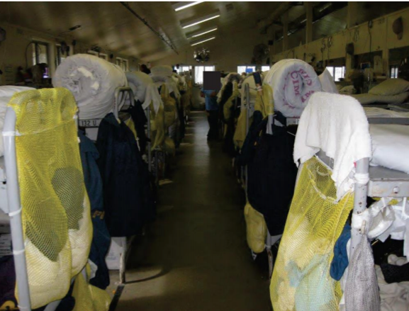

---
meta:
  title: A Few of The Ways That The Prison Law Office...
  author: Joshua Manson
  image: images/joshua-hall-schematic.png
  description: The Prison Law Office has adapted its longstanding battles against overcrowding, inadequate health care, and other dangerous conditions in jails and prisons during the COVID-19 pandemic.
  isBlogPost: true
title: "“An Afterthought”: A Few of The Ways That The Prison Law Office Has
  Renewed Longstanding Battles For Prisoner Rights and Safety During the
  Pandemic"
path: blog/prison-law-office
featured: true
author: Joshua Manson
date: 2021-03-22T18:55:51.173Z
description: The Prison Law Office has adapted its longstanding battles against
  overcrowding, inadequate health care, and other dangerous conditions in jails
  and prisons during the COVID-19 pandemic.
image: images/joshua-hall-schematic.png
template: blog
---

_The following article is based on a conversation held December 31, 2020 as part of our newly launched Oral History Project. Through this initiative, the UCLA Law COVID Behind Bars Data Project is speaking with prisoner rights attorneys and advocates to document their experiences litigating cases on behalf of incarcerated clients during the pandemic and of the systemic failures by legal and political systems to respond adequately._

_More information about this initiative, including recordings of this and other conversations, will soon be available on our website._

_If you are interested in participating in this project, as a conversational subject or a volunteer, please contact dflores@law.ucla.edu_

\_ \_

In March of 2020, when the World Health Organization first declared COVID-19 a pandemic, attorney Rita Lomio was in Arizona on a previously scheduled visit to monitor conditions in state prisons.

Lomio’s organization, the Prison Law Office, has been regularly visiting prisons in Arizona since reaching a 2014 [ agreement](https://prisonlaw.com/wp-content/uploads/2016/04/14.10.14-Doc-1185-Stipulation-Settlement-Agreement-and-exhibits.pdf) with its department of corrections in a case now known as _[Parsons v. Shinn](https://prisonlaw.com/post_case/parsons/)._ In settling the landmark class action lawsuit, the agency agreed to overhaul its severely inadequate health care system while also curbing its use of solitary confinement on people with serious mental illness.

Though her visit was originally planned as a standard visit to evaluate the prison’s general compliance with the terms of that settlement, what Lomio saw inside raised grave and very specific health concerns about the looming public health crisis.

The day Arizona Governor Doug Ducey [declared](https://azgovernor.gov/governor/news/2020/03/covid-19-declaration-emergency-executive-order) a state of emergency, Lomio would soon [tell the court](https://www.aclu.org/legal-document/parsons-v-ryan-declaration-rita-lomio), her clients told her they lacked soap, hand sanitizer, and basic information about the rapidly spreading virus. Prison authorities were frighteningly unprepared: when Lomio asked what the facility’s plan was to isolate people with confirmed or suspected cases, she was told that the entire complex, with a population near 4,000, had just three isolation cells. An employee of the privately contracted health care provider told her that they would later discuss “shifting guys around.”

Poor planning and inadequate health care are not new to Arizona prisons. Despite [agreeing to overhaul its health system](https://prisonlaw.com/wp-content/uploads/2016/04/14.10.14-Doc-1185-Stipulation-Settlement-Agreement-and-exhibits.pdf) as part of that settlement agreement more than six years ago, the agency has largely failed to follow through; in 2018, a federal court found its director in contempt of court and fined the department $1,445,000. The department’s “…repeated failed attempts, and too-late efforts, to take their obligation seriously,” the [judge wrote](https://prisonlaw.com/wp-content/uploads/2018/06/18.06.22-Doc-2898-Order-and-Judgment-of-Civil-Contempt-1.pdf), “demonstrate [d] a half-hearted commitment that must be braced.” In January 2020, another federal judge [threatened to impose](https://prisonlaw.com/wp-content/uploads/2020/08/20.01.31-Doc-3490-Order-to-Show-Cause-re-100-K-contempt-fine.pdf) more than $12 million in additional sanctions.

During the pandemic, as failed medical systems in prisons across the country have been overwhelmed by explosive COVID-19 outbreaks inside, that case against the Arizona Department of Corrections – and the other cases Lomio and her colleagues have been litigating for years against overcrowding and dangerous conditions of confinement in Arizona and California –  have taken on a new urgency.

Just days after Lomio returned to her California office in early March, she and her colleagues on the _Parsons_ legal team began drafting an [emergency motion](https://prisonlaw.com/wp-content/uploads/2020/03/20.03.16-Doc-3520-Plfs-Emergency-Motion-Re-Covid-19.pdf) to protect their Arizona clients. In it, they demanded that the Arizona Department of Corrections develop and implement a plan to mitigate possible outbreaks, and that the agency immediately stop charging incarcerated people for soap and medical care and prohibiting certain hand sanitizers as contraband.

The department and its private medical contractor, they wrote, “have exhibited no interest in preparing for the tsunami that already is in the community and may soon crash through the prison gates (if it is not there already), swamping the department and its contractor’s ability to respond and protect the lives of those in its custody.”

In the months since, according to our [data](https://uclacovidbehindbars.org/states/arizona), at least 52 people have died of COVID-19 in the department’s facilities and more than 12,000 people have tested positive.

---

As in communities across the country, the virus’ spread in prisons, jails, and other carceral facilities has been exacerbated by pre-existing inequalities and political failures. Prison health systems like Arizona’s have long been underfunded, inadequate, and resistant to improvement, and during the pandemic, other dangerous prison conditions, such as overcrowding, have prevented those living inside from social distancing.

In 2009, the Prison Law Office achieved a historic victory against prison overcrowding when it settled _[Plata v. Newsom](https://prisonlaw.com/post_case/plata-v-brown/)_ (then known as Plata v. Brown), a massive class action lawsuit alleging that the prison system’s health care system was so severely inadequate that it amounted to cruel and unusual punishment. The settlement resulted in massive, court-ordered decarceration across the state. That change, Lomio says, may have saved countless lives this past year by reducing population density inside prison facilities.

However, even with the depopulation orders from _Plata_ in place, Lomio explains, the population inside California state prisons has still been high enough to contribute to rapid viral spread, leading to the death of hundreds of incarcerated people.

During the pandemic, the lawsuit, because it pertains to inadequate healthcare, has once again become quite literally a matter of life and death.

In recent weeks, attorneys with the Prison Law Office have, in _Plata_ filings, advocated for safety measures in California prisons during the ongoing COVID-19 crisis, including population reduction, increased testing, safer quarantine and isolation practices, and most recently, broader [vaccine access](https://prisonlaw.com/wp-content/uploads/2021/01/21.01.13-Doc-3530-Joint-CMC-Stmnt.pdf).

…

Since COVID-19 entered erupted in American carceral facilities, Lomio has focused most of her time litigating _[Armstrong v. Newsom](https://prisonlaw.com/major-cases/armstrong-v-newsom/)_, a separate case filed by The Prison Law Office on behalf of people with disabilities held in California prisons. A population that regularly faces compounding injustices while behind bars, they have faced especially cruel circumstances, Lomio says, as prisons have failed to provide basic accommodations and accessible safety measures during the pandemic.

Having seen just how egregiously prisons regularly fail to meet the needs of people with disabilities incarcerated inside, the Prison Law Office legal team was immediately prepared to push back against discrimination and unsafe treatment when the pandemic hit: “We knew that when there's a crisis like this,” Lomio said, “people with disabilities often are an afterthought, and would be less safe than their able bodied peers.”

That involved proactively engaging with California prison officials about how they would address the many challenges that people with disabilities in state prisons will face. How would blind people, for example, have access to basic information that is otherwise posted about COVID-19 and how to protect oneself? Would prison officials ensure that designated quarantine spaces have enough wheelchair-accessible beds set aside for wheelchair users who may become exposed or infected?

Like Arizona’s, the California prison agency was ultimately unprepared, and litigation became necessary to protect the safety of people with disabilities inside. But this avenue for relief presented its own set of challenges, including how to obtain evidence to present to the court when many of the organization’s clients have communication-related disabilities and the agency itself seemed unaware of the scope of the crisis unfolding inside.

In some instances, rather than relying on officially provided information, which was lacking, the legal team was able to cite to firsthand accounts, often through creative channels. In a motion filed over the summer, the legal team relied on a highly-detailed [schematic diagram](https://prisonlaw.com/wp-content/uploads/2020/07/20.07.14-Doc-2996-2-Booth-Dec.pdf#page=329) drawn and provided to their office in 2018 by an [man](https://prisonlaw.com/wp-content/uploads/2020/07/20.07.14-Doc-2996-2-Booth-Dec.pdf#=334) incarcerated at California Institute for Men with experience in technical design and who had concerns about crowding and accessibility. The legal team was able to [cross-reference](https://prisonlaw.com/wp-content/uploads/2020/07/20.07.14-Doc-2996-7-Amarillas-Dec.pdf) his diagram with information provided by the correctional agency to show that, in the one housing unit at the prison with accessible housing, people with active COVID-19 cases were housed alongside non-infected peers because no other accessible housing was available.

<figure>

<figcaption>
  This schematic diagram, originally drawn by a man incarcerated inside, was
  submitted as evidence in court to show that those inside Joshua Hall could not
  safely social distance.
</figcaption>

</figure>

“Instead,” Lomio said, “they were sleeping basically side-by-side, breathing the same air and put at increased risk of getting very sick or dying simply because of their disabilities.” She added, “And these were elderly men who had really significant underlying health conditions that put them at real risk of getting severe illness. It was pretty shocking.”

One client, a full-time wheelchair user who filed a declaration demonstrating his discriminatory quarantine housing, himself died of the virus several months later

In other instances, even if not exposed, people with disabilities faced horrible conditions because of a lack of planning and forethought by the prison agency. When a couple of blind individuals represented by the Prison Law Office were re-located to a gym, Lomio explained, they were never oriented to the space. With cords across the floor and other potential hazards, they stopped drinking fluids, she said, to avoid having to find the bathroom and risk injury. After seeing one of them for a medical appointment, a nurse recorded low blood pressure and health effects stemming from dehydration.

---

Being responsible for monitoring prison conditions during a pandemic, especially when authorities have failed to take bold action to mitigate spread, has been emotionally challenging for Lomio and her colleagues. With each client who has died, she says, the office reviews and sends around medical and disability records, age, and other information to see what happened.

“Every day is bad news,” she said, “and every email can be giving more bad news.”

Nonetheless, Lomio sees signs of hope. As an experienced prisoners’ rights advocate and prison conditions monitor, she has seen more press coverage of what’s happening inside than ever before. With so little attention normally paid to the experience of incarceration, she said, “I think it’s only a good thing for people to understand what's happening in the prison system.”

The urgency of the crisis has also spurred innovation and action on longstanding issues where there was previously little interest by prison authorities. Going forward, after Lomio’s team showed that many incarcerated deaf people were not receiving proper information about how to protect themselves from COVID-19, the state created a television channel dedicated entirely to American Sign Language programming, including videos about COVID-19 safety information from the CDC in addition to regular news programming. Lomio’s team is working with the prison agency to devise new policy to require that blind individuals who are incarcerated be shown how to safely navigate spaces by someone trained in providing orientation services.

Still, the tragedy is wide-reaching and ongoing. And while it’s an epidemiological event, the pandemic has been so explosive behind bars largely due to political and legal structures. Lomio pointed to the 1996 Prison Litigation Reform Act (PLRA), which has slowed down opportunities for emergency release on a mass scale by stripping individual district courts of authority to order population reductions. In March, Lomio and her colleagues filed an [emergency motion](https://prisonlaw.com/wp-content/uploads/2020/03/Dkt-6522-3JC-Pls-Emergency-Mtn-to-Modify-Pop-Reduction-Order-MPA-ISO-03-25-20-0489-3.pdf) asking the court to reduce prison populations to allow for social distancing, including in Joshua Hall. A three-judge panel [denied that motion](https://prisonlaw.com/wp-content/uploads/2020/04/20.04.04-Doc-3261-TJP-Order-Denying-Emergency-Motion.pdf) for procedural reasons, reflecting limitations imposed by the PLRA.

<figure>

<figcaption>
Joshua Hall, an overcrowded unit where people with disabilities have been
incarcerated in close quarters and unable to social distance.
</figcaption>
</figure>

At the same time, Lomio said, despite demands from public health experts, the state of California has not released people on the scale necessary to prevent spread in state facilities.

“The sort of relief that we needed early on in the pandemic, to prevent or mitigate some of the things that we've seen, just didn't come,” said Lomio. “We didn't get judicial release, that sort of bold judicial action that we needed. And now, over 40% of the California prison population has been infected. At some prisons, it’s been 90%.”

_Since the date of this interview, the number of people in [California state prisons](https://uclacovidbehindbars.org/states/california) who have been infected with and who have died from COVID-19 has continued to rise. To date, nearly 50,000 people incarcerated in CDCR facilities have, at some point during the pandemic, tested positive, and at least 216 have died of the virus._
