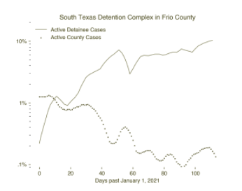

**Introduction**

Since the start of the COVID-19 pandemic, people detained in immigration detention centers around the country have, like those in jails and prisons, suffered alarmingly high rates of the virus. By May 2021, more than 14,000 people had tested positive for COVID-19 while held in ICE detention, though the number of people infected is likely significantly higher.

Over the past few months, COVID-19 rates across the country, including in prisons, have generally fallen. Yet infection rates among people detained in ICE facilities have soared. While the national COVID-19 positivity rate has dropped to below 0.1 percent, the rates among people in immigration detention have climbed to as high as 10 percent, according to ICE’s own published data.  

There are many possible explanations for these surges.  For one, ICE has only recently [agreed to begin offering COVID-19 vaccines](https://www.cnn.com/2021/07/13/politics/immigrant-detainees-vaccine-dhs/index.html) to those in its custody, after months of [passing responsibility to state governments and health agencies](https://www.washingtonpost.com/immigration/ice-detainees-covid-vaccine/2021/03/12/0936ee18-81f5-11eb-81db-b02f0398f49a_story.html). At the same time, the number of people in ICE custody has soared: since reaching a historic low in February 2021, the number of [people held in ICE detention has skyrocketed in recent months](https://www.buzzfeednews.com/article/hamedaleaziz/ice-detainee-numbers-increasing-biden), nearly doubling in just a few months. Additionally, early this year some detention centers experienced increased transfers. The average daily population at Adams County detention center in New Orleans, for example, increased from 250 to over 1,000 by May 2021.

Of particular concern, COVID-19 rates are rising in ICE facilities even as [rates in surrounding counties](https://www.nytimes.com/article/coronavirus-county-data-us.html) are falling, suggesting that simply reducing case rates in surrounding communities is not, on its own, sufficient to prevent large-scale outbreaks in detention centers. As case numbers have declined to low levels in neighboring communities, we found that devastating outbreaks within ICE facilities may still likely be instigated by transmission from staff and exacerbated by dangerous conditions inside.

Even as case numbers appear to recede across the country, slowing viral spread in ICE detention will continue to require implementing aggressive public health measures inside facilities to affect conditions for those detained, beginning with population reduction. Although ICE reduced population levels inside its facilities earlier during the pandemic, reaching record lows during the end of 2020, it has since [restored population numbers to near pre-pandemic levels](https://www.buzzfeednews.com/article/hamedaleaziz/ice-detainee-numbers-increasing-biden). With increased population density inside its facilities, regardless of case levels in surrounding communities, ICE is creating conditions that make mass outbreaks in its facilities increasingly likely and is risking the health and safety of those in its custody in doing so. 

**Analysis**

[Other scholars have found](https://www.medrxiv.org/content/10.1101/2020.04.08.20058842v3) that COVID-19 outbreaks incubated in carceral environments may cause broader outbreaks in surrounding communities. Their work suggests that the movement of incarcerated people and prison and jail employees between facilities and the surrounding county heightens risk of outbreaks, whereas reduced arrests would have significantly curbed rates of COVID-19 overall. 

We are interested specifically in the extent to which higher population density inside immigration detention facilities creates conditions that make outbreaks inside those facilities more likely, even when case numbers in surrounding communities are low.

Because there is so little publicly available data showing and contextualizing COVID-19 rates in immigration detention, we designed an epidemiological model to identify possible mechanisms of viral transmission between communities and ICE facilities, where those inside often cannot practice social distancing nor obtain proper health care. 

In May 2021, COVID-19 case rates skyrocketed in several ICE detention centers, even while local county rates decreased. Figures 1 and 2 map show this phenomenon occurring in two detention facilities in Texas: the Karnes County Residential Center and the South Texas Detention Complex. In both facilities, cases have risen dramatically, despite the fact that both are located in counties that have seen falling rates of COVID-19 over the last four months.

<i>Figure 1. Percent of population infected from January to May 2021 in Karnes County</i>

<i>Figure 5. Karnes County had 200 active COVID-19 cases in the county and four active facility infections the week of January 1st, 2021. We observed that in Karnes County, county COVID-19 rates remained steady during the month of January before sharply decreasing in March. At the same time, cases in the Karnes County Detention Center were rising. Three months later, in April, we observed both an increase in county and facility case rates. Here, high rates in the county contributed to a detention center outbreak, which after several weeks re-entered the county and may have possibly contributed to elevated levels once again**.**</i>

While ICE has not reported employee COVID-19 test results since November, media [reports](https://www.desertsun.com/story/news/2020/09/27/114-covid-19-cases-among-detainees-and-staff-adelanto-ice-facility/3555333001/) have indicated that the virus has run rampant among employees and detained people alike. During a September outbreak in the Adelanto Detention Center in California — a facility owned and operated by the private company GEO group — 33 of the 60 employees working in one wing tested positive, along with more than 80 detained people. 

It only takes a single infected employee to instigate a detention center outbreak on the order of what occurred in Karnes County Residential Center and the South Texas Detention Complex. There is therefore no reason to expect that reduced rates outside a facility will necessarily translate into reduced transmission inside. To the contrary, regardless of reduced rates outside, cases may continue to surge unless and until preventative steps are taken. 

To show how this can happen, we developed epidemiological models fit to COVID-19 infection data from ICE detention centers and their surrounding counties.

To understand the patterns of COVID-19 transmission between the detention centers and surrounding counties, we mathematically modeled the contact patterns of our population of interest. We split the total population of interest into three groups: individuals in detention, the general public of the surrounding county, and detention center employees.  

We assume that detention center employees move between the surrounding county and detention center according to an average daily work shift per person. We estimated the rates of infection among the employees, the people detained, and the rest of the county according to the current literature for COVID-19 rates. Then, we incorporated relevant population and biological factors that impact the rate of disease spread within each group.

From an epidemiological standpoint, the rate at which an infectious disease spreads within populations, or in this case, between these three groups, is largely shaped by two factors: (1) how contagious the disease is, determined by the viral transmission factors specific to COVID-19, and (2) how much opportunity the disease has to spread, known as the contact rate. The contact rate is determined by the average number of people per day that an infected person would interface with for long enough to likely infect.

To capture the first factor, we identified specific biological characteristics of COVID-19 taken from existing literature, including the transmission rate, the average number of people that a sick person infects, the average length of a person’s symptomatic period, and the number of days it takes to show symptoms. 

In terms of contact rates, these differ across populations depending on the environment. Where a population lives in a congregate or clustered setting, or if that population has limited access to personal protective equipment, the contact rate will be higher and the disease will have a relatively greater opportunity to spread than it would among populations able to practice social distancing, who live alone, can easily access personal protective equipment, or are vaccinated.

Guided by estimates from the CDC and disease modeling literature, we estimated that the contact rate in detention facilities is at least three to four times higher than among the general public. We also included in our model the length of work shifts for employees, number of new people brought into detention, and the average length of stay of a person detained in the facility. Then, using the known population data of the surrounding counties and capacity of the ICE facilities, we calibrated our model to fit observed COVID-19 case data (Figures 3 and 4). A technical documentation of the disease model and methods is available here.

We used our model to explore multiple theoretical scenarios illustrating how COVID-19 could have spread between detention centers and their surrounding counties. We show the estimated rates of employee cases, which provide insight into how the disease may have progressed among the county, employees, and detainees. We then show an additional scenario, an idealization, in which we reduce the relative contact rate inside the detention center to approximate that of the county, to show what case rates may have looked like if fewer people were detained or had better access to PPE.