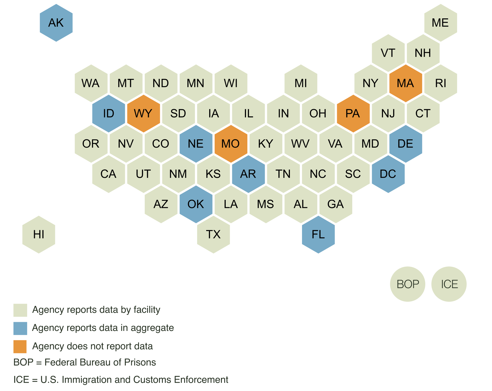

Since the beginning of the pandemic, the UCLA Law COVID-19 Behind Bars Data Project has been collecting COVID-19 data from the online dashboards maintained by correctional agencies nationwide. On our website, we maintain a dataset of facility-level cases, deaths, and tests among incarcerated people and staff, which we update several times a week using web scraping programs we developed to extract publicly reported data.

**Access to COVID-19 data is critical to public health**

We know that decarceration, vaccination, and, at the very least, proper distancing and hygiene protocols are the only ways to abate the disastrous effects of the virus inside carceral facilities. Open access to COVID-19 data in the carceral context helps make the case for these critical public health responses. Without data, policymakers and public health experts lack the evidence needed to respond effectively to the dangerous spread of the coronavirus in carceral facilities. 

At a minimum, agencies should report the cumulative number of COVID-19 cases and deaths among incarcerated people and staff. Other critical variables that should also be made public include active COVID-19 cases, which signals the current prevalence of the virus behind bars, as well as the number of tests administered, which enables the calculation of test positivity rates. A high positivity rate suggests that actual case totals may be higher than detected. 

Ideally, correctional agencies would report data for each individual facility they administer. Without facility-level data, advocates are unable to appropriately direct their efforts, and families and friends of the incarcerated will remain in the dark regarding the situation facing their loved ones. The lack of facility-level data will also hamper local communities in their efforts to prepare for likely and imminent viral spread fueled by outbreaks in nearby prisons and jails. 

Our goal is to collect timely COVID-19 data from as many prisons, jails, and detention centers as possible. However, agencies vary in what and how much data they publicly report. Many fail to report certain key variables, while others report data only in the aggregate (e.g., through statewide totals), rather than at the facility level. The visualizations below highlight the gaps in reporting by state and federal correctional agencies.

The maps include all 50 state departments of corrections (DOCs), the District of Columbia’s Department of Corrections, the Federal Bureau of Prisons (BOP), which manages federal prisons, and the U.S. Immigration and Customs Enforcement (ICE), which manages immigration detention centers. 

**Cumulative COVID-19 cases among incarcerated people**

Carceral agencies generally define cumulative COVID-19 cases as the number of individuals who have ever tested positive for COVID-19 while incarcerated in that facility. Some agencies only report in the aggregate, and others do not report this data at all. As of February 2021, only four state DOCs do not consistently report cumulative cases among incarcerated people: Massachusetts, Missouri, Pennsylvania, and Wyoming.

**COVID-19 deaths among incarcerated people**

Correctional agencies vary in how they report the number of people who have died of COVID-19 while in their custody. Some agencies only report in the aggregate, and others do not report at all. 
As of February 2021, only four state DOCs do not report deaths of incarcerated people: Arkansas, Illinois, Maine, Massachusetts, and Mississippi. 

Agencies also differ in which deaths they consider related to COVID-19. Some include all deaths suspected of being related to COVID-19, and some include only those with a positive test result. In some cases, deaths are excluded, even if they occur after or while someone has COVID-19, if the medical provider or examiner declares an alternative cause of death, such as a heart attack. 

More than one third of agencies fail to report active COVID-19 infections among incarcerated people, whether at the facility or aggregate level. This variable, referring to the number of people who are currently sick, is generally defined as the number of incarcerated individuals who currently have an active infection of COVID-19 and who have not recovered. Of the agencies that do report this data, the majority report at the facility level.

Most agencies do not report the total number of COVID-19 tests administered, and they vary in whether they report the cumulative number of incarcerated people tested or the cumulative number of tests performed on incarcerated people. Of the agencies reporting the total number of tests administered, the majority report at the facility level. 

Nearly one third of agencies neglect to report the total number of staff who have ever tested positive for COVID-19 while working in a given facility. Some only report in the aggregate, and others do not report at all. The definition of “staff” varies by jurisdiction — some include medical staff and others include only correctional staff — and jurisdictions vary as to whether they require staff to self-report testing results not administered by the agency. 

Very few agencies report the number of staff who have died of COVID-19. As mentioned above, agencies differ both in the categories of deaths they consider related to COVID-19 and in their definitions of “staff.”
Of those reporting, the majority report at the facility level.

These visualizations represent the status of data reporting as of February 2021. We plan to update them  on an occasional basis going forward.