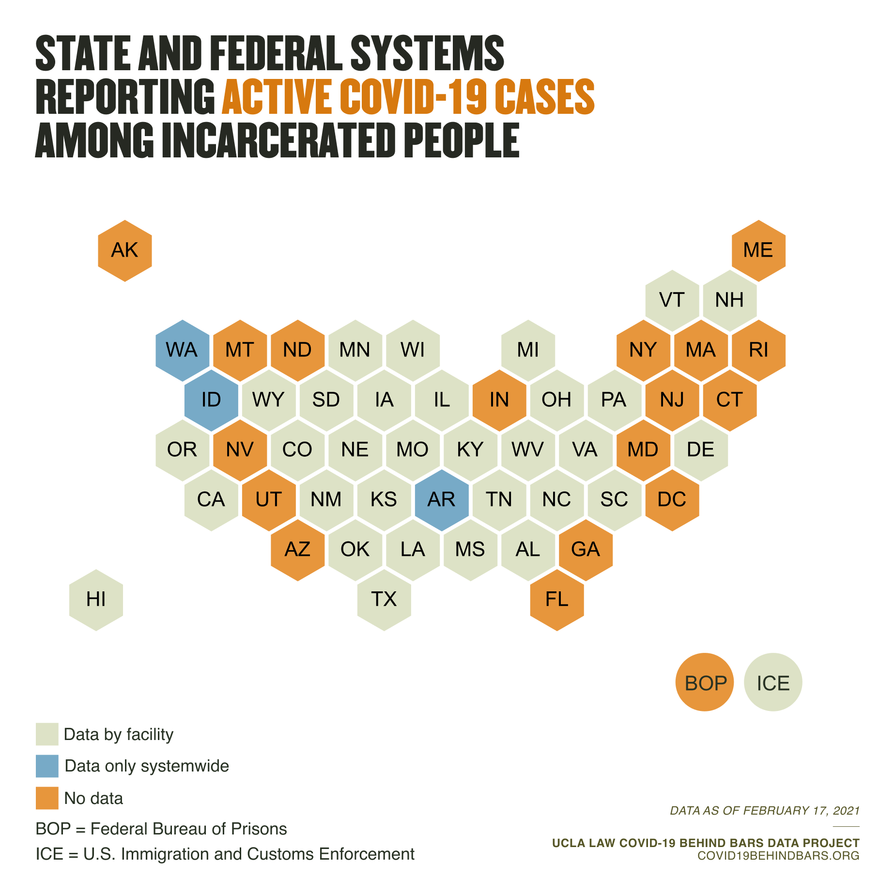

This week, an [article](https://www.ajpmonline.org/article/S0749-3797(21)00118-5/fulltext) published in the American Journal of Preventive Medicine found a high prevalence rate of COVID-19 among prison employees across the country. The peer-reviewed study, co-authored by UCLA Law Professor and Director of the COVID-19 Behind Bars Data Project Sharon Dolovich and affiliated researchers Kalind Parish and Grace DiLaura, found that prison staff have been infected with COVID-19 at 3.2 times the rate of the U.S. population as a whole. Julie Ward of the Johns Hopkins Bloomberg School of Public Health was lead author; Brendan Saloner, also of JHBPH, was senior author.

<i>the caption text</i>

From March to early November, the study found, the U.S. general population saw an average of 13 new cases per 100,000 people each day. During the same time period, the article shows, the case rate among staff of U.S. prisons grew daily by an average of 42 new cases per 100,000 people.

The study’s authors cross-referenced COVID-19 data collected by the UCLA Law COVID-19 Behind Bars Data Project with publicly available personnel data from state and federal departments of corrections to measure the scale of what they called an “unprecedented occupational hazard” for employees of American prisons.

The identified case rate among prison staff, while more than triple that of the country’s general population, was still considerably lower than that among people incarcerated in American prisons. According to the study, the mean daily case rate among the incarcerated population was  61 cases per 100,000 people — nearly five times that of the country’s population as a whole.

A July [article](https://jamanetwork.com/journals/jama/fullarticle/2768249) by the same authors published in the Journal of the American Medical Association found that in addition to contracting COVID-19 at a higher rate, incarcerated people have also been dying at a much higher rate. That study found that, in the early months of the pandemic, incarcerated people had been dying of COVID-19 at a rate three times that of their same-age, non-incarcerated peers.

The AJPM article also found that, in the vast majority of prison systems, case rates were initially higher among staff than among incarcerated populations. By May they were roughly equal between the two groups across the country, and by November the rate for the country’s incarcerated population as a whole was nearly 50% higher than for prison staff. 

This finding offers additional evidence that prison staff may be a key vector, inadvertently introducing the virus into prison facilities where it then ravages incarcerated populations, who are, the authors note, “less able to perform self-protective behaviors.” For this reason, the article suggests that “staff surveillance” may be “critical to the prompt detection of COVID-19 in prisons.”

Though heightened staff case rates demonstrate the epidemiological importance of tracking cases among staff, the Data Project has found that a number of prison systems fail -- or, in some cases, even in response to requests, refuse -- to publish testing data for prison staff. [Nearly one third of prison agencies](https://uclacovidbehindbars.org/blog/data-reporting) do not report how many staff members have tested positive for COVID-19; a majority don’t even make public how many employees have died of the virus.

The article’s findings also underscore the urgency of immunizing not only incarcerated people but also staff to prevent or slow spread. While prison employees, often categorized as essential workers, have enjoyed early access to COVID-19 vaccines in many states, reports from states across the country — including [North Carolina](https://www.northcarolinahealthnews.org/2021/02/22/only-35-of-nc-prison-staff-willing-to-take-vaccine/), [Oregon](https://www.wweek.com/news/2021/02/10/state-officials-expect-45-of-oregon-prison-staff-to-refuse-a-covid-19-vaccine/), [California](https://www.sacbee.com/news/politics-government/the-state-worker/article249123895.html), [Massachusetts](https://www.wgbh.org/news/local-news/2021/02/08/more-than-half-of-mass-corrections-workers-have-refused-covid-vaccine), and [Iowa](https://www.desmoinesregister.com/story/news/2021/01/28/prison-workers-refuse-covid-19-vaccine-iowa-department-of-corrections/4294691001/) — indicate that prison employees are refusing vaccination at alarmingly high rates.

Throughout the pandemic, shared exposure to the virus has created an unusual common cause for incarcerated people and facility staff — one group’s deadly living quarters is the other’s hazardous workplace. The ACLU [teamed up](https://www.aclu.org/press-releases/aclu-and-council-prison-locals-call-mass-testing-all-employees-and-incarcerated) with a union representing Federal Bureau of Prisons employees to demand mass testing of both staff and incarcerated people. In Chicago, attorneys for Cook County Jail employees [penned a letter](https://www.macarthurjustice.org/wp-content/uploads/2020/04/01-3.pdf) to the county sheriff and board of commissioners calling attention to “unconscionable” conditions, shared by incarcerated people and jail staff, that they said “reflect\[ed] a cavalier disregard for human life.” And when people incarcerated in Washington D.C. jails filed a lawsuit sued administrators for their failure to implement COVID-19 safety measures, the D.C. police union filed a [brief](https://www.acludc.org/sites/default/files/banks_v_booth.23.fop_amicus.pdf) in support of the incarcerated plaintiffs, explaining that staff “believe that their lives are at risk if Plaintiffs do not succeed in portraying to the Court the truth of the inferno in which they work.” 

This week’s AJPM article is one of a number of forthcoming analyses drawing on data collected by the UCLA Law COVID-19 Behind Bars Data Project.