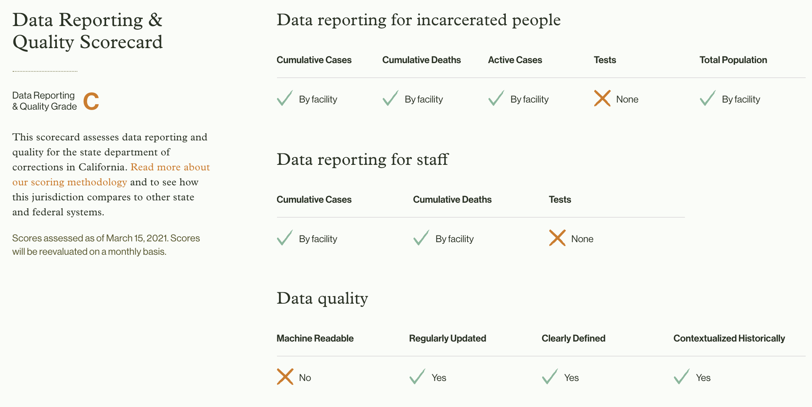

In March, we released our [Data Reporting & Quality Scorecards](https://uclacovidbehindbars.org/blog/scorecard) assessing the transparency of each of the 53 major state and federal agencies. We provided grades for which COVID-19 data they report (our data reporting metrics) and how they report those data (our data quality metrics). On April 12th, we reassessed the scores and grades for each agency.

In the first round of assessments, 75% of correctional agencies received an F. In this round, 81% of agencies did. [Click here](https://docs.google.com/spreadsheets/d/1ygkFpF7NVX4qfMs6_spaLM3Aev-JvnGakvWPCkDNuDk/edit#gid=1826037637) for the raw scorecard data for all 53 agencies. 

Changes in grades largely resulted from the addition of scorecard metrics for vaccination data reporting, which added four points to the total possible score for each agency. As of this week, all state and federal agencies have begun providing vaccinations to at least some staff and people in custody, but not all are reporting publicly on who and how many people are receiving them.

Scores for vaccination data reporting were assessed based on whether each agency posts (a) the numbers of incarcerated people and staff who have received at least one dose of the vaccine, (b) the number of people who have completed their vaccination schedule, and/or (c) the number of doses or vaccines administered. 

While we granted points for a range of vaccination variables, we especially urge agencies to report, at a minimum, the number of people who have received the vaccine and to display partial and completed vaccinations separately. Given that vaccines vary in the number of doses required, it is not possible to discern how many people have been vaccinated when only the number of doses administered is reported. 

The Minnesota DOC, for example, reports separate totals for individuals who received their first and second doses (as well as those who received the single-dose Johnson & Johnson vaccine), allowing us to clearly understand how many people have been partially and fully vaccinated. 

Agencies that do not clearly define their vaccine variables (i.e. those that simply use the term “vaccinations” with no definition visible on its dashboard) lost points for the "clearly defined" data quality metric (explained in more detail below).

<i>Scorecard for the California Department of Corrections and Rehabilitation</i>

Key changes:

In the second round of scoring, one agency’s grade increased: the Alabama Department of Corrections, which reports facility-level data on vaccinations for staff and incarcerated people, improved from an F to a D. However, it is important to note that this agency does not clearly define any of its metrics, so while its overall score increased due to adding vaccination data, its score for the “clearly defined” metric remains at 0.

Grades for the state correctional agencies in Indiana, North Carolina, and Oregon dropped from Cs to Ds due to limited or no vaccination data reporting. The grade for the Michigan Department of Corrections dropped from a D to an F for the same reason. The Colorado Department of Corrections’ grade also went from a D to an F, though, in this instance, the agency received points for reporting vaccination data but lost points for failing to clearly define it. 

[As we mentioned in an earlier post](https://uclacovidbehindbars.org/blog/bopdata), we’ve also adjusted the grade for the Federal Bureau of Prisons since the first scoring round (from a D to an F), because we learned that the agency does not report the metrics it initially purported to.

We once again note that the scores we have assigned to the agencies do not reflect our judgment on how each has managed and responded to COVID-19 inside prisons, nor how reliably we believe the reported data correspond to true facts on the ground. They only reflect  our judgments on how comprehensive the data are and how well they are presented.

### **About the Metrics**

#### **Data Reporting**

Our metrics for data reporting are tied to the ten key variables we aim to collect from each jurisdiction. Out of these, six relate to incarcerated people and four concern correctional staff. [We have previously outlined](https://uclacovidbehindbars.org/blog/data-reporting) why, at a minimum, all correctional agencies should report COVID-19 cases, deaths, and tests for incarcerated people and staff, and also explained why the reporting of real-time facility-level population data is essential. Knowing how many people are incarcerated at each facility puts total cases, deaths, and tests in context. Finally, knowing the number of people who have been vaccinated is critical to understanding how the pandemic is being managed behind bars. No agency, with the exception of the West Virginia Division of Corrections and Rehabilitation, reports all ten variables, and even this agency fails to report some variables at the facility level.

To assign scores for data reporting, we first assessed whether an agency reports each variable at all, and then whether it reports the variable in statewide aggregates or at the facility level. The scores allocated to these variables ranged from 0-2: 0 points if the variable is not reported, 1 point if the agency only reports statewide aggregates, and 2 points if the agency provides facility-level data for that variable.

Data Reporting Metrics — Incarcerated People:

* Cumulative cases: The agency reports the number of individuals who have ever tested positive for COVID-19 while incarcerated at a particular facility.
* Cumulative deaths: The agency reports the total number of individuals who have died with or from COVID-19 while incarcerated in a particular facility. (Note: Some agencies do not include people who were positive for COVID-19 but were found to have died of another cause. Our position is that agencies should include all people who had COVID-19 and died, and note whether infection was the cause of their death.)
* Cumulative tests: The agency reports the total number of tests performed on incarcerated individuals throughout the pandemic. (Note: While a few agencies report the number of people tested, agencies only receive points for reporting the number of tests administered. Monitoring for COVID-19 requires regular testing and reporting only the number of people tested obscures the regularity of testing.)
* Active cases: The agency reports the total number of individuals currently incarcerated at a particular facility who have an active infection of COVID-19 and have not been deemed recovered.
* Total population: The agency reports the total number of individuals incarcerated within a particular facility. (Note: As with all other metrics, agencies only receive points for including total population on their COVID-19 dashboards, not for reporting population elsewhere on their website.)
* Vaccinations: The agency reports the number of incarcerated people who have received at least one dose of the vaccine, the number of people who have completed their vaccination schedule, and/or the number of vaccine doses administered. (Note: While we gave points for multiple types of vaccination variables, we urge agencies to report the number of people who have received doses. Given that vaccines vary in the number of doses required, it is not possible to discern how many people have been vaccinated when only the number of doses or vaccines is reported. Agencies that do not clearly define which vaccine variable they are reporting lost points for the "clearly defined" metric.)

Data Reporting Metrics — Staff:

* Cumulative cases: The agency reports the total number of confirmed COVID-19 cases among staff at a particular facility.
* Cumulative deaths: The agency reports the total number of staff who have died with or from COVID-19 who worked in a particular facility.
* Cumulative tests: The agency reports the total number of tests performed on staff throughout the pandemic.
* Vaccinations: The agency reports the number of staff who have received at least one dose of the vaccine, the number of people who have completed their vaccination schedule, and/or the number of vaccine doses administered. (Note: While we gave points for multiple types of vaccination variables, we urge agencies to report the number of people who have received doses. Given that vaccines vary in the number of doses required, it is not possible to discern how many people have been vaccinated when only the number of doses or vaccines is reported. Agencies that do not clearly define which vaccine variable they are reporting lost points for the "clearly defined" metric.)

#### **Data Quality**

The data quality section of the scorecard consists of four metrics related to the manner in which agencies report the ten variables mentioned above. We assessed agencies on whether or not their data are presented in a format that can be easily read by computer software, whether they report data on a regular basis (i.e., at least weekly), whether they clearly define the variables they report, and whether they display any historical data for at least one of these variables. Although machine-readability may only be important to a particular set of data users, it is a critical feature of functional dashboards that enable researchers to collect and compare data efficiently.

Each data quality metric was assessed on a binary metric: 2 points were awarded for ‘Yes’ and 0 points for ‘No’. We awarded 2 points for ‘Yes’ rather than 1 so that the data quality metrics were weighted equally to the data reporting metrics.

Data Quality Metrics

* Machine readable: Data are presented in API, json, csv, or xml formats. Static images, pdfs, and html formats are not considered machine readable.
* Regularly updated: Data are updated at least once per week, with a visible timestamp.
* Clearly defined: Variable definitions are visible on the agency website (e.g., in a data dictionary or table footnotes).
* Contextualized historically: Historical data for at least one of the key variables are displayed on the agency website.

There are several nuanced problems with data quality that were not captured by the above metrics. For example, we have observed [unexplained fluctuations](https://www.post-gazette.com/news/crime-courts/2021/02/01/pennsylvania-corrections-prisons-significant-flaws-coronavirus-data-health-prisoners-tests/stories/202102010067) in the total number of COVID-19 tests and deaths reported by the Pennsylvania Department of Corrections. In response to inquiries about the inconsistencies, the agency [took its dashboard offline](https://www.media.pa.gov/Pages/corrections_details.aspx?newsid=495) in late January to make adjustments. The PA DOC lost points for the data it was missing as of the scoring date, but we did not alter grades for changes in reporting. (Note: The PA DOC reinstated its dashboard shortly after we finished assessing scores for the second round. These updates will be reflected in round 3.)

A different but related issue exists with the data reported by the correctional departments in Florida, Arkansas, and Wyoming — over the course of the pandemic, the agencies have gradually reduced the granularity of data included on their dashboards, becoming less transparent over time. Again, the DOCs lost points on our scorecard for not reporting key variables, but we did not alter grades for changes in transparency.

Where such issues exist, raising specific concerns about data transparency, we have noted and briefly explained each issue that we have observed on each state’s page. While not comprehensive, these notes provide important context about agencies’ reporting practices.

#### **Assigning Letter Grades**

We assigned standard letter grades to each agency based on the percentage of points earned out of a maximum total of 28. The letter grades are associated with score ranges as follows:

A: 26-28 

B: 23-25

C: 20-22

D: 17-19

F: <16

We will continue to reassess scores on a monthly basis. Please let us know if you use this scorecard as a tool to advocate for better data transparency and quality in your state.

#### **Carceral Agency Scores**

\[insert table]